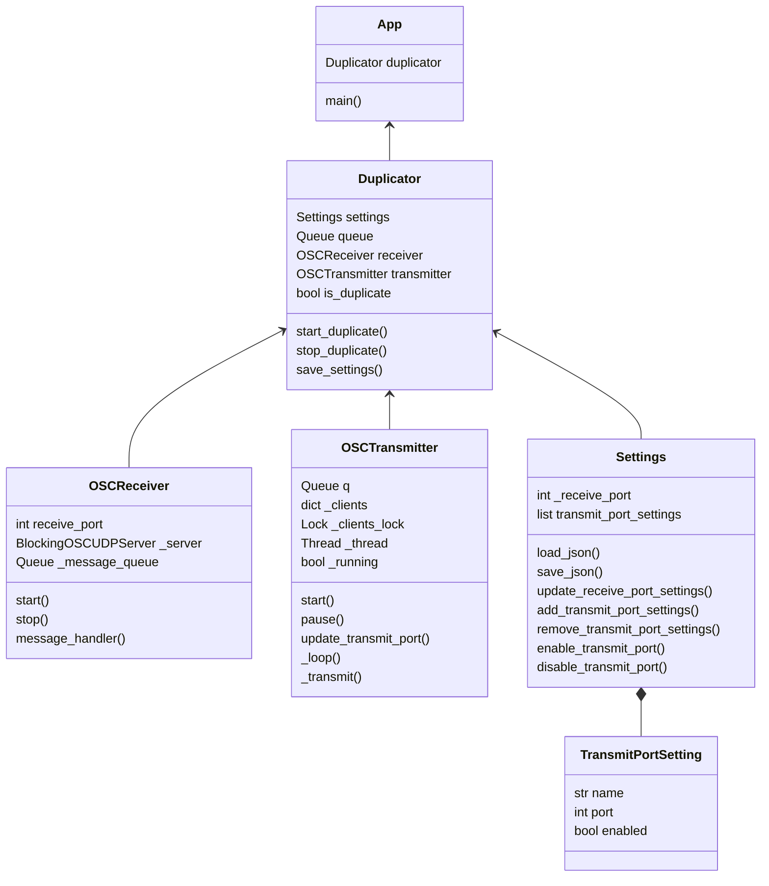

## class diagram

```mermaid
classDiagram
class App
App : Duplicator duplicator
App : main()

class Duplicator
Duplicator : Settings settings
Duplicator : Queue queue
Duplicator : OSCReceiver receiver
Duplicator : OSCTransmitter transmitter
Duplicator : bool is_duplicate
Duplicator : start_duplicate()
Duplicator : stop_duplicate()
Duplicator : save_settings()

class OSCReceiver
OSCReceiver : int receive_port
OSCReceiver : BlockingOSCUDPServer _server
OSCReceiver : Queue _message_queue
OSCReceiver : start()
OSCReceiver : stop()
OSCReceiver : message_handler()

class OSCTransmitter
OSCTransmitter : Queue q
OSCTransmitter : dict _clients
OSCTransmitter : Lock _clients_lock
OSCTransmitter : Thread _thread
OSCTransmitter : bool _running
OSCTransmitter : start()
OSCTransmitter : pause()
OSCTransmitter : update_transmit_port()
OSCTransmitter : _loop()
OSCTransmitter : _transmit()


class Settings
Settings : int _receive_port
Settings : list transmit_port_settings
Settings : load_json()
Settings : save_json()
Settings : update_receive_port_settings()
Settings : add_transmit_port_settings()
Settings : remove_transmit_port_settings()
Settings : enable_transmit_port()
Settings : disable_transmit_port()

class TransmitPortSetting
TransmitPortSetting : str name
TransmitPortSetting : int port
TransmitPortSetting : bool enabled

App <-- Duplicator
Duplicator <-- Settings
Duplicator <-- OSCReceiver
Duplicator <-- OSCTransmitter
Settings *-- TransmitPortSetting
```